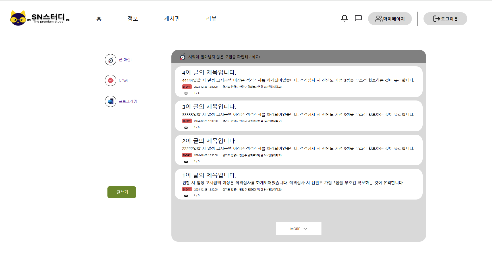
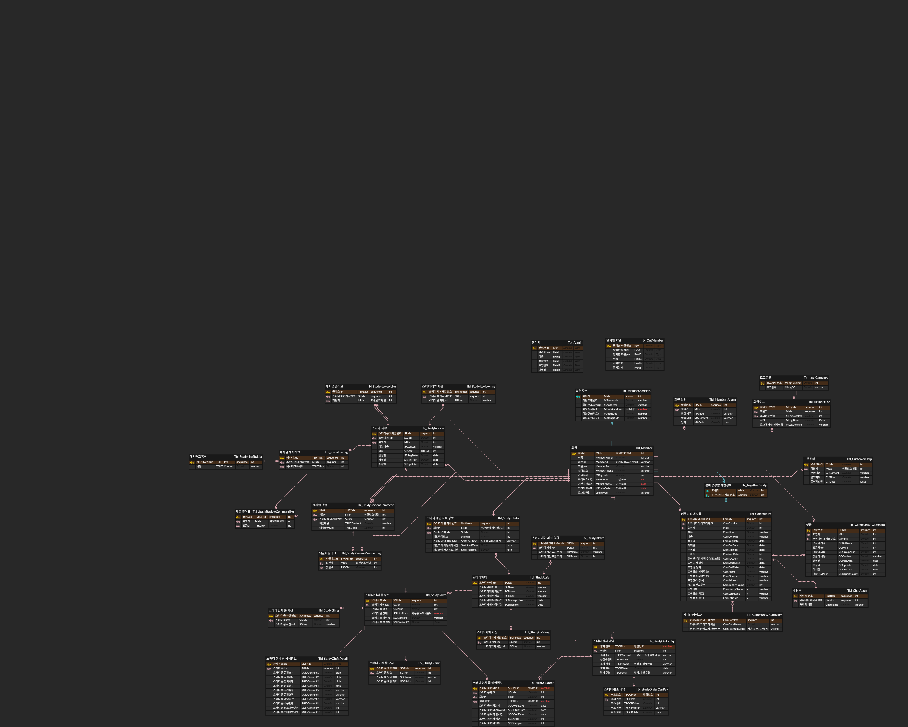

# Study-Res-System

## 프로젝트 개요

Study-Reservation-System은 기존 예약 시스템의 복잡한 절차와 소통의 부재를 해결하기 위해 개발되었습니다.

## ERD

### 기술 스택
- **Backend**: Java, Spring Framework, MyBatis
- **Frontend**: React
- **Database**: Oracle

## 참고 자료

- [프로젝트 발표 자료](./references/24_3B_Snake프로젝트.pdf)

- [프로젝트 디지텍 자료](./references/digitech.pdf)
